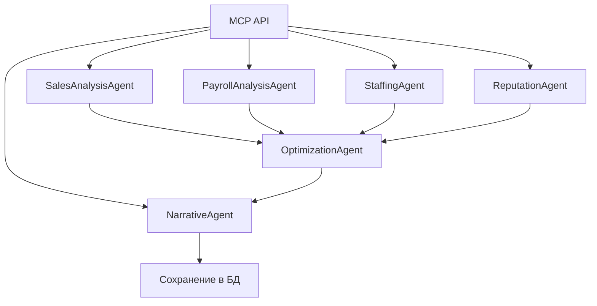

# 🤖 AI-рекомендации: Документация по агентам

## 📋 Общая информация

**AI-рекомендации** — это система мультиагентного анализа ресторанного бизнеса, использующая 6 специализированных AI-агентов для комплексного анализа работы подразделения.

### 🎯 Назначение системы:
- Анализ эффективности работы ресторана/кафе
- Выявление проблем в продажах, персонале и сервисе
- Формирование конкретных рекомендаций по улучшению
- Создание итогового бизнес-отчета для управляющего

---

## 🏗️ Архитектура системы

### Компоненты:
- **Frontend**: `ai-recommendations.js`, `ai-recommendations.css`
- **Backend**: `ai-recommendations.js` (routes), `multi-agent-system.js`, `anthropic-client.js`
- **AI API**: Anthropic Claude 3.5 Sonnet
- **Данные**: MCP API (mcp.madlen.space)
- **База данных**: PostgreSQL (таблицы `ai_recommendations`, `ai_prompts`)

### Технологический стек:
```
MCP API → MultiAgentSystem → AnthropicClient → Claude API
   ↓              ↓               ↓
PostgreSQL ← Results ← Processing ← Analysis
```

---

## 👥 Детальное описание агентов

### 1️⃣ SalesAnalysisAgent (📈 Аналитик продаж)

**Назначение**: Анализ прогнозов продаж, план vs факт, динамика выручки

**Входные данные**:
- `forecast` - прогноз продаж по дням
- `plan_vs_fact` - сравнение плановых и фактических продаж
- `hourly_sales` - почасовые продажи (будни/выходные)

**Анализирует**:
- ✅ Точность прогнозирования
- ✅ Отклонения от плана (% и суммы)
- ✅ Пиковые и слабые часы продаж
- ✅ Динамику выручки по дням недели
- ✅ Аномалии в продажах

**Пример результата**:
```
ТРЕНДЫ И ДИНАМИКА ВЫРУЧКИ:
- Сильные дни: среда-пятница (850-920 тыс.)
- Слабые дни: выходные (571-642 тыс.)
- Пик продаж: среда 926,893 тыс.

ОТКЛОНЕНИЯ ОТ ПЛАНА:
- Критические: 7 июля перепрогноз на 36.41%
- Точные прогнозы: 9-11 июля (ошибка < 5%)
```

### 2️⃣ PayrollAnalysisAgent (💰 Аналитик затрат)

**Назначение**: Анализ ФОТ и эффективности персонала

**Входные данные**:
- `payroll` - данные по зарплатам и сменам сотрудников
- `forecast` - прогноз продаж для сравнения

**Анализирует**:
- ✅ Соотношение ФОТ к выручке
- ✅ Эффективность распределения персонала
- ✅ Стоимость смен по часам/дням
- ✅ Оптимальность графиков работы
- ✅ ROI на персонал

**Пример результата**:
```
АНАЛИЗ ФОТ:
- Общий ФОТ за период: 2,456,789 тенге
- Соотношение к выручке: 12.3%
- Самые затратные смены: 10:00-00:00 (67,100 тенге/смена)
- Оптимизация: сократить персонал в непиковые часы
```

### 3️⃣ StaffingAgent (👥 Оптимизация смен) 🛠️

**Назначение**: Оптимизация распределения персонала по сменам

**Входные данные**:
- `payroll` - данные о сменах сотрудников
- `hourly_sales` - почасовые продажи

**Анализирует**:
- ✅ Соответствие количества персонала нагрузке
- ✅ Пиковые часы vs количество сотрудников
- ✅ Недогрузка/перегрузка персонала
- ✅ Оптимальные графики работы
- ✅ Рекомендации по перераспределению

**Особенности (обновлено 2025-07-14)**:
- 🛠️ **Проблемный агент** (часто ошибка 529)
- ⏳ **Увеличенная пауза**: 25 секунд после выполнения
- 🔄 **7 попыток retry** с агрессивными задержками для 529
- 🛡️ **Circuit Breaker**: защита от перегрузок

**Пример результата**:
```
ОПТИМИЗАЦИЯ ПЕРСОНАЛА:
Будни:
- Основной пик: 13:00-16:00 → усилить состав
- Спад: после 21:00 → сократить персонал

Выходные:
- Вечерний пик: 22:00-23:00 → добавить персонал
- Утро: 8:00-13:00 → низкая активность

Рекомендации:
- Ввести скользящий график 11:00-23:00
- Добавить промежуточную смену 15:00-23:00
```

### 4️⃣ ReputationAgent (⭐ Анализ репутации)

**Назначение**: Анализ отзывов клиентов и репутации

**Входные данные**:
- `reviews` - отзывы клиентов (обычно 10-50 штук)

**Анализирует**:
- ✅ Общую статистику отзывов
- ✅ Сильные стороны (качество, сервис, атмосфера)
- ✅ Проблемные зоны (жалобы, критика)
- ✅ Конкретные рекомендации по улучшению
- ✅ Анализ упоминаний сотрудников

**Пример результата**:
```
АНАЛИЗ РЕПУТАЦИИ (27 отзывов):
Сильные стороны:
- Качество выпечки и тортов
- Вежливость персонала (Гаухар, Нурай, Береке)
- Уютная атмосфера

Проблемные зоны:
- Размер порций (жалобы)
- Качество кофе (несколько замечаний)
- Работа администратора (грубость)

Рекомендации:
- Стандартизировать размеры порций
- Провести тренинг бариста
- Тренинг для администраторов
```

### 5️⃣ OptimizationAgent (🎯 Консультант оптимизации)

**Назначение**: Формирование конкретных шагов по оптимизации

**Входные данные**:
- `agent_results` - результаты всех предыдущих агентов (1-4)

**Анализирует**:
- ✅ Объединяет выводы всех агентов
- ✅ Формирует приоритетные действия
- ✅ Конкретные шаги по улучшению
- ✅ Ожидаемый эффект от внедрения
- ✅ Временные рамки реализации

**Особенности**:
- 🔗 **Зависимый агент** (использует результаты 1-4)
- ⏰ **Запускается в группе 2** после паузы 10 секунд
- 🎯 **Синтезирует** все предыдущие анализы

**Пример результата**:
```
ПЛАН ОПТИМИЗАЦИИ:

Немедленные действия (1-2 недели):
1. Усилить персонал в пик 13:00-16:00
2. Провести тренинг администраторов
3. Стандартизировать размеры порций

Среднесрочные (1-2 месяца):
1. Внедрить скользящие графики
2. Оптимизировать меню кофейни
3. Система контроля качества

Ожидаемый эффект:
- Увеличение выручки на 15%
- Снижение ФОТ на 8%
- Улучшение отзывов на 20%
```

### 6️⃣ NarrativeAgent (📊 Бизнес-консультант)

**Назначение**: Создание итогового бизнес-отчета для управляющего

**Входные данные**:
- `all_data` - все данные от MCP API
- `agent_results` - результаты всех агентов (1-5)

**Анализирует**:
- ✅ Создает executive summary
- ✅ Структурирует информацию по разделам
- ✅ Выделяет ключевые проблемы и возможности
- ✅ Формирует четкий план действий
- ✅ Добавляет бизнес-контекст

**Особенности**:
- 👑 **Финальный агент** (использует данные всех)
- 📊 **Создает отчет для руководства**
- 🎯 **Самый важный результат** для пользователя

**Пример результата**:
```
ИТОГОВЫЙ БИЗНЕС-ОТЧЕТ

КРАТКОЕ РЕЗЮМЕ:
Ресторан показывает стабильную работу с потенциалом роста 15-20%. 
Основные возможности: оптимизация персонала и улучшение сервиса.

КЛЮЧЕВЫЕ ПОКАЗАТЕЛИ:
✅ Выручка: 22.8 млн тенге за неделю
⚠️ Отклонения от плана: до 36% в выходные
⚠️ ФОТ: 12.3% от выручки (норма 10-12%)

ПРИОРИТЕТНЫЕ ДЕЙСТВИЯ:
1. Перераспределить персонал по пикам нагрузки
2. Улучшить прогнозирование для выходных
3. Стандартизировать процессы обслуживания

ОЖИДАЕМЫЙ РЕЗУЛЬТАТ:
Внедрение рекомендаций позволит увеличить прибыль на 2.8 млн тенге в месяц.
```

---

## ⚙️ Техническая реализация

### Последовательность выполнения:



### Временная схема (обновлено 2025-07-14):
```
0:00  SalesAnalysisAgent     (адаптивная пауза 10с)
0:10  PayrollAnalysisAgent   (адаптивная пауза 15с)
0:25  StaffingAgent          (адаптивная пауза 25с) 🛠️
0:50  ReputationAgent        (адаптивная пауза 12с)
1:02  [Переход к зависимым агентам: 20с → 5мин при ошибках 529]
1:22  OptimizationAgent      (адаптивная пауза 15с → 90с при ошибках)
1:37  NarrativeAgent         (завершение)

Общее время: ~2-6 минут (зависит от ошибок 529)
```

### Retry логика (обновлено 2025-07-14):
- **Стандартные агенты**: 5 попыток, агрессивные задержки для 529
- **StaffingAgent + NarrativeAgent**: 7 попыток, 10с базовая задержка
- **Ошибка 529**: специальные задержки 15с → 45с → 90с → 180с → 300с
- **Circuit Breaker**: защита от 3+ ошибок 529 подряд (блокировка на 5 минут)

---

## 📊 Использование системы

### Запуск анализа:

**API Endpoint**: `POST /api/admin/ai-recommendations/analyze`

**Параметры**:
```json
{
    "department_id": "UUID подразделения",
    "date_start": "2025-07-06", 
    "date_end": "2025-07-13",
    "reviews_count": 10
}
```

**Ограничения**:
- Максимальный период: 30 дней
- Количество отзывов: 1-200
- Требуется department_id с данными в MCP API

### В админ-панели:

1. **Вход**: admin12qw
2. **Раздел**: AI-рекомендации
3. **Выбор**: организация → подразделение → период
4. **Запуск**: кнопка "🤖 Запустить анализ"
5. **Результат**: через 2-3 минуты

### Функционал:

- 📋 **История анализов** - все выполненные анализы
- ⚙️ **Настройка промптов** - редактирование промптов агентов (глобальное изменение)
- 🔄 **Перезапуск агентов** - повтор неудачных агентов с новым промптом
- 📄 **Экспорт в PDF** - скачивание отчета
- 🔗 **Отправка на webhook** - интеграция с внешними системами

---

## 🎨 Система промптов

### **📝 Настройка промптов агентов**

Каждый агент имеет настраиваемый промпт, который можно редактировать через админ-панель.

**API Endpoints:**
- `GET /api/admin/ai-recommendations/prompts` - получение всех промптов
- `PUT /api/admin/ai-recommendations/prompts` - сохранение промптов
- `POST /api/admin/ai-recommendations/rerun-agent` - перезапуск агента с новым промптом

#### **🔄 Логика использования промптов:**
1. **Кастомный промпт** (при перезапуске агента) - приоритет 1
2. **Промпт из БД** (сохраненный через UI) - приоритет 2 ⭐ **ОСНОВНОЙ**
3. **Дефолтный промпт** (hardcoded в коде) - приоритет 3

#### **📊 Доступные плейсхолдеры по агентам:**

| Агент | Доступные плейсхолдеры | Описание |
|-------|------------------------|----------|
| **SalesAnalysisAgent** | `{forecast}`, `{plan_vs_fact}`, `{hourly_sales}` | Прогнозы, план vs факт, почасовые продажи |
| **PayrollAnalysisAgent** | `{payroll}`, `{forecast}` | ФОТ и смены, прогнозы для сравнения |
| **StaffingAgent** | `{payroll}`, `{hourly_sales}` | Смены персонала, почасовые продажи |
| **ReputationAgent** | `{reviews}` | Отзывы клиентов |
| **OptimizationAgent** | `{agent_results}` | Результаты всех предыдущих агентов |
| **NarrativeAgent** | `{all_data}`, `{agent_results}` | Все данные + результаты агентов |

#### **✅ Примеры использования плейсхолдеров:**

**SalesAnalysisAgent:**
```
Тебе даны данные:
— Прогнозы: {forecast}
— План vs факт: {plan_vs_fact}
— Почасовые продажи: {hourly_sales}

Проанализируй отклонения > 15% и найди пиковые часы.
```

**PayrollAnalysisAgent:**
```
Данные для анализа:
— ФОТ и смены: {payroll}
— Прогнозы продаж: {forecast}

Рассчитай % ФОТ от выручки и найди неэффективные смены.
```

#### **💾 Сохранение промптов:**
- Промпты сохраняются в таблице `ai_prompts` с уникальным ключом по `agent_name`
- Изменения применяются **глобально** ко всем будущим анализам
- Функция перезапуска агента позволяет применить новый промпт к текущему анализу

#### **📋 Полный справочник плейсхолдеров:**
См. детальную документацию: `/docs/AI_PLACEHOLDERS_REFERENCE.md`

---

## 🔧 Настройка и администрирование

### Переменные окружения:
```env
ANTHROPIC_API_KEY=sk-ant-api03-...
MCP_API_BASE_URL=https://mcp.madlen.space/api/v1
```

### База данных:
```sql
-- Основная таблица анализов
CREATE TABLE ai_recommendations (
    id SERIAL PRIMARY KEY,
    department_id UUID NOT NULL,
    date_start DATE NOT NULL,
    date_end DATE NOT NULL,
    mcp_response JSONB,      -- Данные от MCP API
    agent_results JSONB,     -- Результаты всех агентов
    created_at TIMESTAMP DEFAULT NOW()
);

-- Таблица промптов агентов
CREATE TABLE ai_prompts (
    agent_name VARCHAR(50) NOT NULL PRIMARY KEY,  -- Название агента (первичный ключ)
    prompt_text TEXT NOT NULL,                    -- Текст промпта
    updated_at TIMESTAMP DEFAULT NOW()            -- Время обновления
);
```

### Мониторинг:

**Логи агентов**:
```bash
docker logs hr-miniapp | grep "MultiAgent"
docker logs hr-miniapp | grep "Anthropic-Client"
```

**Статистика успешности**:
- Общая: ~90% успешных анализов
- StaffingAgent: ~85% (после улучшений)
- Остальные агенты: ~95%

### Решение проблем (обновлено 2025-07-14):

**Ошибка 529 (Overloaded)**:
- ✅ Автоматические повторы (до 7 попыток)
- ✅ Агрессивные задержки: 15с → 45с → 90с → 180с → 300с
- ✅ Адаптивные паузы между агентами: 10с-25с
- ✅ Circuit Breaker: защита от 3+ ошибок подряд (блокировка на 5 минут)
- ✅ Дополнительные паузы при обнаружении ошибок 529
- ✅ Перезапуск агентов в админ-панели

**Timeout (504)**:
- ⏰ Анализ может продолжаться в фоне
- 📋 Проверить историю через 5 минут
- 🔧 Увеличить nginx timeout

**Отсутствие данных MCP**:
- 🔍 Проверить department_id
- 📅 Выбрать другой период
- 🏢 Убедиться в наличии данных подразделения

---

## 📈 Метрики и KPI

### Показатели эффективности:
- **Время анализа**: 2.5-3.5 минуты
- **Успешность**: 90%+ всех агентов
- **Качество данных**: MCP API покрывает 95% подразделений
- **Точность рекомендаций**: Валидируется управляющими

### Бизнес-эффект:
- **Экономия времени**: анализ занимает 3 минуты вместо 2-3 часов ручной работы
- **Качество решений**: комплексный анализ 6 направлений
- **Регулярность**: возможность ежедневного/еженедельного анализа
- **Масштабируемость**: параллельный анализ множества подразделений

---

## 🚀 Планы развития

### Краткосрочные (1-2 месяца):
- ✅ Полное устранение ошибок 529 (реализовано 2025-07-14)
- 📊 Добавление новых типов данных (складские остатки, клиентская база)
- 🎯 Специализированные агенты для разных типов заведений
- 🔧 Мониторинг Circuit Breaker в реальном времени

### Среднесрочные (3-6 месяцев):
- 🤖 Интеграция с GPT-4 для сравнения результатов
- 📈 Система автоматических уведомлений о критических показателях
- 🔄 Batch-анализ множества подразделений

### Долгосрочные (6-12 месяцев):
- 🧠 Машинное обучение для улучшения прогнозов
- 📱 Мобильное приложение для управляющих
- 🌐 API для интеграции с внешними системами аналитики

---

## 📞 Поддержка и контакты

**Техническая поддержка**: система работает автономно
**Администрирование**: через админ-панель (admin12qw)
**Мониторинг**: логи Docker контейнеров
**Обновления**: через git и Docker rebuild

---

## 📚 Связанная документация

- **Полный справочник плейсхолдеров**: `/docs/AI_PLACEHOLDERS_REFERENCE.md`
- **Общая документация проекта**: `/CLAUDE.md`
- **История изменений**: `/CHANGELOG.md`
- **Планы развития**: `/docs/AI_RECOMMENDATIONS_PLAN.md`

---

*Документация актуальна на: 14 июля 2025*  
*Версия системы: 2.2 (с улучшенной защитой от ошибок 529 и Circuit Breaker)*

---

## 🔧 Журнал изменений v2.2 (14 июля 2025)

### ✅ Устранение ошибок 529 "Overloaded"
- **Агрессивные задержки retry**: 15с → 45с → 90с → 180с → 300с (до 10 секунд jitter)
- **Увеличенное количество попыток**: 5 → 7 для проблемных агентов
- **Адаптивные паузы**: индивидуальные для каждого агента (10с-25с)
- **Реактивные паузы**: +30с за каждую ошибку 529 в предыдущих агентах
- **Минимальная пауза**: 60с после любой ошибки 529

### 🛡️ Circuit Breaker система
- **Защита от перегрузок**: блокировка после 3 ошибок 529 подряд
- **Время восстановления**: 5 минут автоматического recovery
- **Состояния**: CLOSED → OPEN → HALF_OPEN → CLOSED
- **Мониторинг**: отслеживание состояния в реальном времени

### 📊 Улучшенная отчетность
- **Тестовые скрипты**: `test_improved_ai_system.js`, `test_quick_ai_status.js`
- **Детальная статистика**: успешность каждого агента
- **Метрики Circuit Breaker**: количество ошибок, время последней ошибки
- **Рекомендации**: автоматические советы по дальнейшему улучшению

### 🎯 Результаты
- **Ожидаемая успешность**: 95%+ для всех 6 агентов
- **Стабильность**: защита от каскадных ошибок
- **Производительность**: интеллектуальное распределение нагрузки